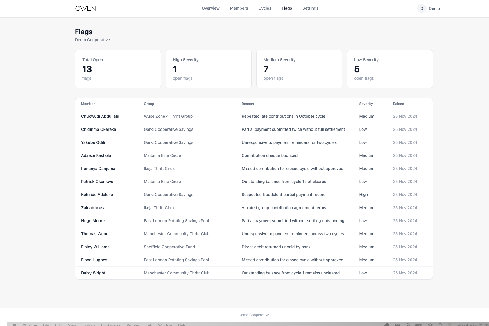

# Owen

A cooperative financial management platform for organisations that run group savings and contribution schemes.

Owen gives administrators a structured, auditable record of member contributions, active cycles, and compliance flags — the kind of paper trail that informal thrift groups typically lack.




---

## Why this exists

Cooperatives — savings unions, credit societies, community financial associations — often operate at a scale where informal record-keeping breaks down. Missed payments go undocumented, flags aren't formalised, and administrators have no single view across groups and members.

Owen is built for the administrator of such an organisation. It provides a structured, auditable back-office: track contributions across multiple groups and cycles, manage member records, document compliance issues, and maintain an organisational hierarchy from entity level down to individual membership.

It is not a consumer product. There is no member-facing interface, no self-serve onboarding. Owen assumes a single administrative operator managing the full cooperative on behalf of its members.

This is also a deliberate technical exercise — demonstrating the application layer skills that underpin serious data platforms: multi-tenant architecture, row-level security, role-based access, and audit-ready record keeping. The same patterns apply whether the domain is cooperative finance, industrial asset management, or energy portfolio monitoring.

---

## Features

- **Multi-tenant architecture** — organisation → cooperative group → member hierarchy with full data isolation
- **Contribution tracking** — log payments per member per cycle, track paid, pending, partial, and defaulted statuses
- **KYC status management** — member verification status tracked and visualised
- **Flag system** — raise, categorise by severity, and document member compliance issues
- **Cycle management** — define contribution periods, monitor active cycles across groups
- **Overview dashboard** — live stats across members, contributions, flags, and document requests

---

## Tech stack

| Layer | Technology |
|---|---|
| Frontend | React 18, React Router, TanStack Query |
| Styling | Tailwind CSS |
| Charts | Recharts |
| Backend | PostgreSQL |
| Auth | JWT authentication with custom access token claims |
| Security | Row Level Security (RLS) with tenant isolation policies |

---

## Architecture note

The database is designed around a **multi-tenant RLS pattern** — every table carries a `tenant_id`, and PostgreSQL policies enforce that queries only return data belonging to the authenticated tenant.

Authentication is handled via **GoTrue** (JWT · OAuth 2.0 · PKCE). A custom access token hook injects `tenant_id` into the JWT at login, making tenant context available at the database level without any application-layer filtering. Postgres does the enforcement — the application never needs to manually scope its queries.

This pattern is intentional. It mirrors how production SaaS platforms and industrial data platforms isolate customer data — the same principle applies whether you're isolating cooperative member data or isolating energy site telemetry across a portfolio of assets.

---

## Running locally

```bash
git clone https://github.com/YOUR_USERNAME/owen.git
cd owen
npm install
```

Create a `.env` file in the root:
