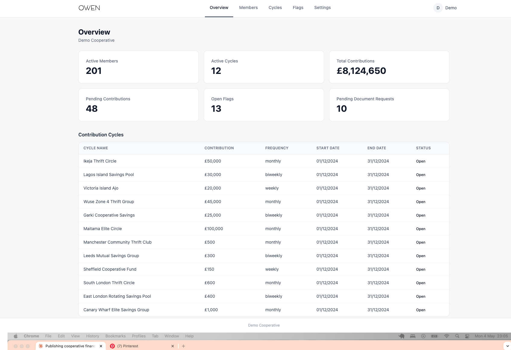
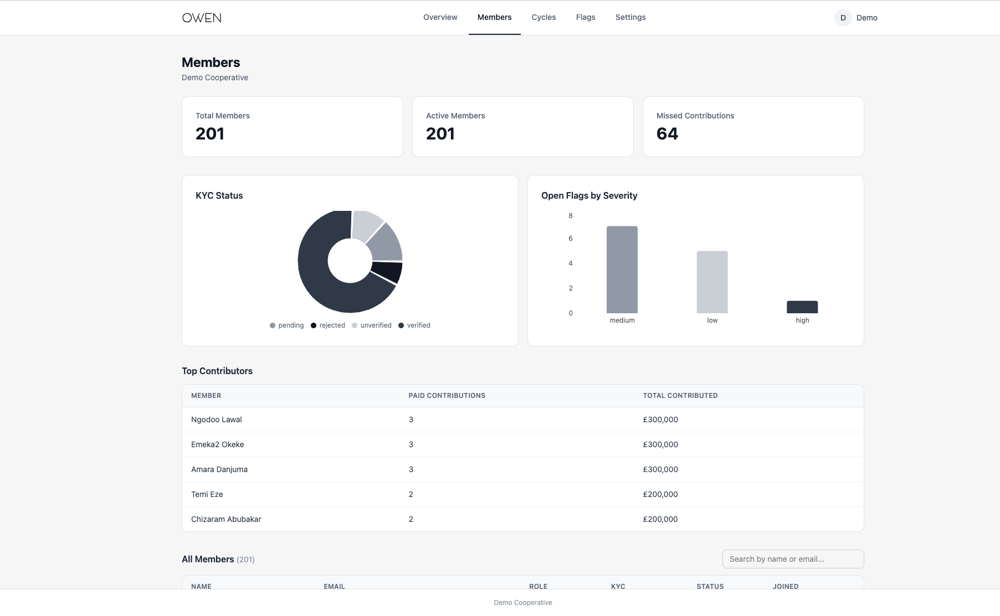

# Owen

**A multi-tenant platform for structured financial record-keeping and audit-ready compliance — with security enforced in the database, not the application.**

Owen gives administrators of cooperative financial organisations a structured,
auditable record of member contributions, active cycles, and compliance flags — the
kind of accountable paper trail that spreadsheets and paper registers can't provide.




---

## Why this exists

Cooperatives — savings unions, credit societies, community financial associations —
often operate at a scale where informal record-keeping breaks down. Missed payments
go undocumented, flags aren't formalised, and administrators have no single view
across groups and members.

Owen is built for the administrator of such an organisation. It provides a structured,
auditable back-office: track contributions across multiple groups and cycles, manage
member records, document compliance issues, and maintain an organisational hierarchy
from entity level down to individual membership. It is not a consumer product — there
is no member-facing interface. Owen assumes a single administrative operator managing
the full cooperative on behalf of its members.

It's also a deliberate engineering exercise. The problem — many isolated tenants,
money-adjacent records that must never leak or be quietly altered, and an audit trail
that has to hold up — is the same problem serious data platforms solve, whether the
domain is cooperative finance, industrial asset management, or energy-portfolio
monitoring. Owen solves it the way those platforms do: **at the database layer.**

---

## Security & data model

Most of the engineering in Owen lives in [`schema.sql`](schema.sql). The application
never scopes its own queries for security — Postgres does, so a bug in the frontend
can't leak another tenant's data.

- **Tenant isolation by default.** Every table carries a `tenant_id`, defaulted from a claim the auth layer injects into the JWT at login. RLS policies enforce that queries only ever see the authenticated tenant's rows — no application-layer filtering, no way to forget it.
- **Role-gated financial policies.** Reading and writing money-adjacent tables (contributions, cycles, payouts) requires *both* tenant match *and* an `admin`/`treasurer` role. A regular member's token satisfies tenant isolation but is still refused on financial writes — defence in depth rather than a single gate.
- **Append-only audit logs.** Audit records are made immutable at the database with rules that reject `UPDATE` and `DELETE`. Once written, history can't be quietly rewritten — including by the application itself.
- **Server-derived status.** Contribution status (paid / pending / partial / defaulted) is derived by a database trigger from the actual amounts, not set by the client. The frontend can't declare a contribution "paid"; the database decides.
- **Hardened definer functions.** The helper functions that read auth claims run `SECURITY DEFINER` with `SET search_path TO ''`, closing the search-path attack that catches most hand-rolled Postgres security code.
- **Referential safety.** Amount/quantity check constraints, per-tenant unique constraints (e.g. case-insensitive member email), and `ON DELETE RESTRICT` throughout prevent orphaned or contradictory financial records.

Authentication is handled via **GoTrue** (JWT · OAuth 2.0 · PKCE); a custom access-token
hook is what injects `tenant_id` into the token at login. The result is a system where
tenant context is available at the lowest level and enforcement is impossible to bypass
from above — the same pattern used to isolate customer data in production SaaS, or site
telemetry across a portfolio of energy assets.

---

## Features

- **Multi-tenant hierarchy** — organisation → cooperative group → member, with full data isolation
- **Contribution tracking** — log payments per member per cycle; paid, pending, partial, and defaulted statuses derived server-side
- **Cycle management** — define contribution periods and monitor active cycles across groups
- **KYC status management** — member verification status tracked and visualised
- **Flag system** — raise, categorise by severity, and document member compliance issues
- **Overview dashboard** — live stats across members, contributions, flags, and document requests

---

## Tech stack

| Layer | Technology |
|---|---|
| Frontend | React 19, React Router, TanStack Query |
| Styling | Tailwind CSS |
| Charts | Recharts |
| Reporting | jsPDF + autotable (tenant-aware currency formatting) |
| Database | PostgreSQL (Supabase) |
| Auth | GoTrue — JWT · OAuth 2.0 · PKCE, custom access-token claims |
| Security | Row-Level Security, role-gated policies, append-only audit rules |

---

## Running locally

```bash
git clone https://github.com/kunleowolabi/owen.git
cd owen
npm install
```

Create a `.env` file in the root:

```
VITE_SUPABASE_URL=your_supabase_project_url
VITE_SUPABASE_KEY=your_supabase_anon_key
```

Then:

```bash
npm run dev
```

To run against your own backend, apply [`schema.sql`](schema.sql) (and optionally
[`seed.sql`](seed.sql)) to a new Supabase project via the SQL editor, then update
your `.env`.

---

## Database

The full schema — tables, enums, RLS policies, role-gated financial policies,
append-only audit rules, indexes, and the custom auth hook — is in
[`schema.sql`](schema.sql). It's the most complete single artefact in the repo and
the best place to read the actual engineering.
